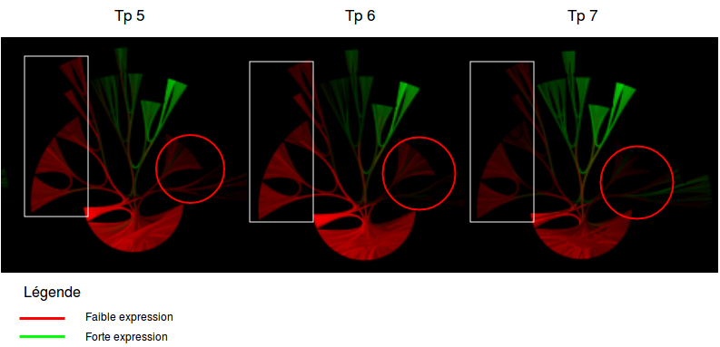

# Gene Expression Visual Investigation with Tulip

# Introduction

This project involves developing a Python program using Tulip software to analyze and visualize gene expression data in Escherichia coli. This bacterium, commonly found in mammalian intestines, is cultured in a medium enriched with glucose and lactose, with gene expression tracked over time. The program aims to generate graphs, facilitating the understanding of how gene expression levels evolve. The goal is to establish a connection between gene groups and specific functions, shedding light on the relationship between gene expression patterns and the bacterium's response to the enriched medium.


Here is the result of our investigation to generate inovative and robust graphs to visualize our results.

## Input

- Given input is a Gene Expression file (RNAseq) - subset of 1150 genes
- Genes interractions & pre defined clusters 

All the information above were given for 17 different Timpe Points (TP)

# Results 


*Visualization of the hierarchical tree with the radial algorithm implemented with Tulip*


*Gene interaction*


*Calculation of shortest path between Nodes and edges (see implemented functions: find_path(), BFS_search())*


*Small Multiples visualization of the gene expression Time Points*



*Gene expression level for TP5, 6, 7*


*Gene expression level for TP7, 11, 13*


*Gene expression level for TP13, 14, 17*


*LacY & LacZ gene expression at TP11*

# Conclusion 

In conclusion, Tulip proves to be a valuable tool for visualizing gene expression data, offering a comprehensive set of features and the flexibility to implement algorithms or develop custom functions using Python. Despite occasional issues with resource-intensive calculations, Tulip stands out for its ability to handle a vast amount of information and generate a human readable visualization. 

The analysis of Escherichia coli gene expression, focusing on growth in a glucose and lactose-containing medium was possible using the framework. Visualization techniques like Small Multiples was implemented to understanding the bacterium's growth. To enhance this study, future comparisons with other graph visualization software, such as Cytoscape, could provide additional insights.

# TODO

* CIRCOS Diagram to implement with Tulip
* [...]

# Requirements

## Language & Framework

- [Tulip (v5.2.1)]([url](https://tulip.labri.fr/Documentation/current/tulip-python/html/index.html#)https://tulip.labri.fr/Documentation/current/tulip-python/html/index.html#)
- Python 2.7
  - urllib (standard library)
  - regex (standard library)
  - time (standard library)

Note that Tulip output & Project can be exported as .tlpx format.

## Documentation

The Documentation has been generated with Epydoc. 

Usage:

```bash
epydoc [--html] input_file.py [-o] output

epydoc [ --pdf] input_file.py [-o] output
```

Follow this [link](https://coddy33.github.io/Tulip_project_doc/) to find the documenation.

# Sources 

- [Tulip Python 5.7.3 documentation]([url](https://tulip.labri.fr/Documentation/current/tulip-python/html/index.html#)https://tulip.labri.fr/Documentation/current/tulip-python/html/index.html#)


